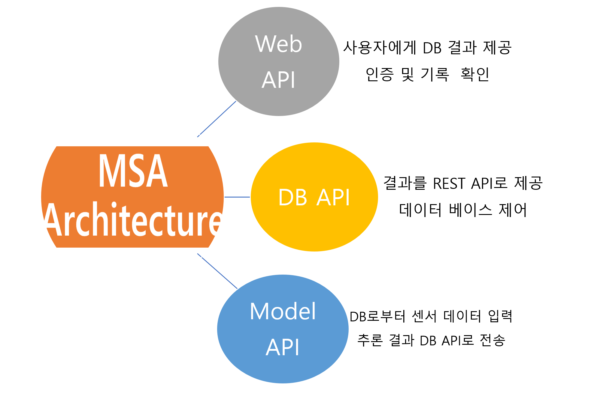

# DB server
- 디지털 대시보드 서비스 DB를 위한 repo
- 서비스 제공을 위해서는 서버 repo가 동작하고 있어야 합니다.
- DB 서버는 
- 프로젝트 디렉토리 구조
    ```
    DB_server
    ├── server
    │   ├── app
    │   │   ├── app_routing.py
    │   │   ├── db_row_count.py
    │   │   ├── dbinfo.py
    │   │   ├── insert_json_data_append.py
    │   │   ├── output_pred.py
    │   │   ├── outputdb.py
    │   │   └── request_infer.py
    │   ├── env
    │   │   ├── id.txt
    │   │   └── pw.txt
    │   └── main.py
    └── util
    ```


## 데이터베이스 서버 및 시스템 작동구조

이 시스템을 이해하기 위해선 3개의 REST API Server 구조를 이해해야 함 



3개의 작은 서비스간의 통신을 통해 하나의 시스템을 완성하여 제공하는 것이 이 시스템의 핵심 
여기서 DB API를 담당하는 레포로 인식하면 됨 


## 실행 방법
1. env 파일 넣기
   - DB와 직접 통신 하는 경우를 대비한 id, pw
   - 프로젝트 디렉토리 구조 참고
2. server로 디렉토리로 이동 후 서버를 백그라운드에서 동작  
    - 백그라운드에서 동작하지 않는 경우 main.py를 직접 실행
    ```bash
    cd server
    nohup uvicorn --reload main:route --port {포트번호} --host 0.0.0.0 &
    ```

## 


## Acknowledgement
```
“본 연구는 과학기술정보통신부 및 정보통신기획평가원의 SW전문인재양성사업의 연구결과로 수행되었음“(2022-0-01127)
```
